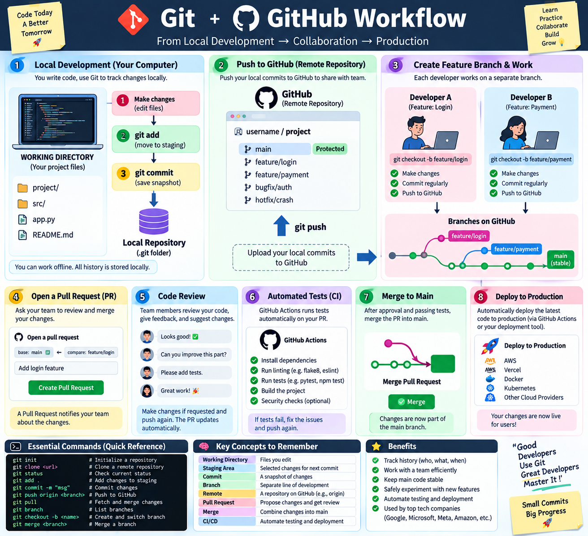

## Foundation

## Git & GitHub — Complete Development Workflow
### From Local Development → Version Control → Collaboration → Code Review → CI/CD → Production

## 🧠 Git’s internal architecture: `.git/`, Git Objects, Hash, Blob, Tree, Commit, Branch, and HEAD.

A quick visual revision of Git’s internal architecture: `.git/`, Git Objects, Hash, Blob, Tree, Commit, Branch, and HEAD.

### **Core flow:** `File Content → Blob → Tree → Commit → Branch → HEAD`

> **Understand the internals once, and Git becomes much easier to reason about.**

